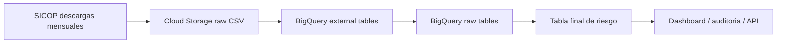

# NAI Analytics - SICOP Public Procurement Audit

Propietaria: Nancy Raquel Rodriguez Ramos

Este repositorio documenta y automatiza un caso de analitica avanzada para contratacion publica en Costa Rica usando datos masivos descargados del SICOP. El objetivo es construir una base analitica completa y un motor de alertas para control preventivo, auditoria y deteccion de inconsistencias.

## Que demuestra este proyecto

- Arquitectura de datos para archivos mensuales masivos.
- Carga de CSV historicos a Google Cloud Storage y BigQuery.
- Union de tablas SICOP por procedimiento, proveedor, oferta, adjudicacion, contrato y recepcion.
- Reglas de auditoria para identificar inconsistencias.
- Score de riesgo por procedimiento.
- Base lista para dashboard ejecutivo en Looker Studio, Power BI o una web NAI.

## Arquitectura



Destino BigQuery usado en este proyecto:

```text
fifco-marketing-dev.ExploracionDataTeam
```

## Estructura del repositorio

```text
src/
  gcp_sicop_pipeline.py        # Carga a GCS/BigQuery y construye el modelo
sql/
  01_external_and_raw_tables.sql
  02_risk_model.sql
docs/
  sicop_schema_profile.md      # Perfil de archivos y variables
  security.md                  # Reglas para no publicar secretos/datos pesados
web/
  index.html                   # Landing page del caso NAI Analytics
.github/workflows/
  pages.yml                    # Publicacion gratis en GitHub Pages
```

## Proceso GCP

1. Descargar y descomprimir los CSV mensuales de SICOP localmente o en Cloud Shell.
2. Subir los CSV a Cloud Storage.
3. Crear tablas externas y tablas raw en BigQuery.
4. Construir la tabla final `nai_sicop_procedure_risk_scored`.
5. Conectar un dashboard a BigQuery.

Ejemplo:

```bash
python3 src/gcp_sicop_pipeline.py \
  --bucket fifco-marketing-dev-sicop-raw \
  --raw-base /ruta/a/bases \
  --create-bucket \
  --upload \
  --create-bigquery \
  --build-risk
```

Si el bucket ya existe globalmente, cambiar el nombre:

```bash
--bucket nai-sicop-raw-nancy
```

## Tabla final

La tabla final esperada es:

```text
fifco-marketing-dev.ExploracionDataTeam.nai_sicop_procedure_risk_scored
```

Incluye:

- Identificacion del procedimiento.
- Institucion.
- Montos estimados, ofertados, adjudicados y contratados.
- Conteos de lineas, ofertas, adjudicaciones, contratos y recepciones.
- Banderas de riesgo.
- Score de riesgo.
- Nivel de riesgo.

## Reglas de auditoria incluidas

- Oferta antes de publicacion.
- Invitacion posterior a oferta.
- Adjudicacion antes de oferta.
- Contrato antes de adjudicacion.
- Diferencias de monto mayores a 5%.
- Cantidad ofertada o adjudicada mayor a la solicitada.
- Codigo de producto distinto entre cartel y oferta.
- Proveedor adjudicado sin oferta localizada.
- Adjudicacion sin contrato.
- Contrato sin recepcion.
- Proveedor adjudicado con sanciones.
- Alertas estadisticas por percentiles.

## Uso comercial

Este caso se presenta como:

```text
NAI Analytics para Auditoria Publica
```

La web publica puede mostrar metodologia, capturas, resultados agregados y contacto. El detalle completo, datos crudos y dashboards operativos deben manejarse como producto privado o acceso controlado.

## Web gratuita

Este repositorio incluye una landing page estatica en `web/index.html`. Para publicarla gratis:

1. Ir a `Settings` en GitHub.
2. Entrar a `Pages`.
3. En `Build and deployment`, seleccionar `GitHub Actions`.
4. Ejecutar el workflow `Deploy NAI SICOP web` si no corre automaticamente.

La URL esperada sera similar a:

```text
https://nayrr25.github.io/SICOP/
```
